# PDF Annotation System - Comprehensive Schema

> **Last Updated:** 2025-10-20
> **System:** TCS Woodwork ERP - PDF Annotation & Cabinet Pricing System

## Table of Contents
- [Database Schema](#database-schema)
- [Entity Relationships](#entity-relationships)
- [API Endpoints](#api-endpoints)
- [Project Tree Structure](#project-tree-structure)
- [Workflows](#workflows)
- [Annotation Types](#annotation-types)
- [Data Flow](#data-flow)
- [Page Types & Metadata](#page-types--metadata)
- [Performance Considerations](#performance-considerations)
- [Complete System Interconnection](#complete-system-interconnection)

---

## Database Schema

### Core Tables


---

## Entity Relationships

### Hierarchical Structure


### Annotation Types & Hierarchy


---

## API Endpoints

### Endpoint Structure

| Method | Endpoint | Description | Auth |
|--------|----------|-------------|------|
| `GET` | `/api/pdf/page/{pdfPageId}/annotations` | Load all annotations for a page | ✓ |
| `POST` | `/api/pdf/page/{pdfPageId}/annotations` | Save/replace annotations for a page | ✓ |
| `DELETE` | `/api/pdf/page/annotations/{annotationId}` | Delete single annotation | ✓ |
| `GET` | `/api/pdf/page/{pdfPageId}/context` | Get available rooms, runs, cabinets for dropdowns | ✓ |
| `GET` | `/api/pdf/page/{pdfPageId}/project-context` | Get project info for cover page auto-populate | ✓ |
| `GET` | `/api/pdf/page/{pdfPageId}/project-number` | Get project number | ✓ |
| `GET` | `/api/pdf/page/{pdfPageId}/annotations/history` | Get annotation change history | ✓ |
| `GET` | `/api/pdf/page/{pdfPageId}/metadata` | Get page type and metadata | ✓ |
| `POST` | `/api/pdf/page/{pdfPageId}/metadata` | Save page type and metadata | ✓ |
| `POST` | `/api/pdf/page/{pdfPageId}/page-type` | Save page type only | ✓ |
| `GET` | `/api/pdf/annotations/page/{pdfPageId}/cabinet-runs` | Get cabinet runs for project | ✓ |

### API Request/Response Formats

#### Load Annotations (`GET /api/pdf/page/{pdfPageId}/annotations`)

**Response:**
```json
{
  "success": true,
  "annotations": [
    {
      "id": 1,
      "x": 0.25,
      "y": 0.30,
      "width": 0.40,
      "height": 0.25,
      "text": "Kitchen",
      "room_type": "kitchen",
      "color": "#3B82F6",
      "annotation_type": "room",
      "cabinet_run_id": null,
      "room_id": 5,
      "notes": "Main kitchen area"
    }
  ],
  "last_modified": "2025-10-20T14:32:00Z",
  "count": 1
}
```

#### Save Annotations (`POST /api/pdf/page/{pdfPageId}/annotations`)

**Request:**
```json
{
  "annotations": [
    {
      "annotation_type": "room",
      "x": 0.25,
      "y": 0.30,
      "width": 0.40,
      "height": 0.25,
      "text": "Kitchen",
      "room_type": "kitchen",
      "color": "#3B82F6",
      "notes": "Main kitchen area",
      "context": {
        "create_room": true,
        "room_name": "Kitchen",
        "room_type": "kitchen",
        "floor_number": "1"
      }
    }
  ],
  "create_entities": true
}
```

**Response:**
```json
{
  "success": true,
  "message": "Annotations saved successfully",
  "count": 1,
  "annotations": [...],
  "created_entities": [
    {
      "annotation_id": 1,
      "entity_type": "room",
      "entity_id": 5,
      "entity": { "id": 5, "name": "Kitchen", "room_type": "kitchen" }
    }
  ],
  "entities_created_count": 1
}
```

#### Get Context (`GET /api/pdf/page/{pdfPageId}/context`)

**Response:**
```json
{
  "success": true,
  "context": {
    "project_id": 1,
    "project_name": "25 Friendship Lane - Residential",
    "rooms": [
      {
        "id": 5,
        "name": "Kitchen",
        "room_type": "kitchen",
        "floor_number": "1",
        "display_name": "Kitchen (Kitchen)"
      }
    ],
    "room_locations": [
      {
        "id": 12,
        "name": "North Wall",
        "room_id": 5,
        "room_name": "Kitchen",
        "location_type": "wall",
        "display_name": "Kitchen - North Wall"
      }
    ],
    "cabinet_runs": [
      {
        "id": 8,
        "name": "Base Run 1",
        "run_type": "base",
        "room_location_id": 12,
        "room_id": 5,
        "room_name": "Kitchen",
        "location_name": "North Wall",
        "display_name": "Kitchen - North Wall - Base Run 1"
      }
    ],
    "cabinets": [...]
  }
}
```

---

## Project Tree Structure

### Tree API Endpoint

**Endpoint:** `GET /api/projects/{projectId}/tree`

**Purpose:** Returns hierarchical structure of all rooms, locations, and cabinet runs for the annotation sidebar

**Response Format:**
```json
[
  {
    "id": 5,
    "name": "Kitchen",
    "type": "room",
    "annotation_count": 12,
    "children": [
      {
        "id": 8,
        "name": "North Wall",
        "type": "room_location",
        "annotation_count": 5,
        "children": [
          {
            "id": 3,
            "name": "Base Run 1",
            "type": "cabinet_run",
            "annotation_count": 3
          },
          {
            "id": 4,
            "name": "Upper Cabinets A",
            "type": "cabinet_run",
            "annotation_count": 2
          }
        ]
      },
      {
        "id": 9,
        "name": "Island",
        "type": "room_location",
        "annotation_count": 4,
        "children": [...]
      }
    ]
  },
  {
    "id": 6,
    "name": "Master Bathroom",
    "type": "room",
    "annotation_count": 8,
    "children": [...]
  }
]
```

### Tree View Modes

The annotation system supports **two tree view modes** controlled by the sidebar toggle:

```mermaid
graph LR
    A[Tree View Mode] --> B[Group by Room]
    A --> C[Group by Page]

    B --> D[Room → Location → Run]
    C --> E[Page → Room → Location → Run]

    style B fill:#d4edda
    style C fill:#fff3cd
```



#### 1. Group by Room (Default)

**Hierarchy:**
```
📂 Kitchen (Room)
  ├─ 📍 North Wall (Location)
  │   ├─ 📦 Base Run 1 (Cabinet Run)
  │   └─ 📦 Upper Cabinets A (Cabinet Run)
  ├─ 📍 Island (Location)
  │   └─ 📦 Base Run 2 (Cabinet Run)
  └─ 📍 Peninsula (Location)
```

**Use Case:** Best for understanding room organization and creating annotations based on physical room structure

**Data Source:** `/api/projects/{projectId}/tree`

#### 2. Group by Page

**Hierarchy:**
```
📄 Page 2 - Floor Plan
  ├─ 📂 Kitchen (Room)
  │   ├─ 📍 North Wall (Location)
  │   └─ 📦 Base Run 1 (Cabinet Run)
  └─ 📂 Breakfast Nook (Room)
📄 Page 3 - Kitchen Elevation
  ├─ 📂 Kitchen (Room)
  │   ├─ 📍 North Wall (Location)
  │   └─ 📦 Upper Cabinets A (Cabinet Run)
```

**Use Case:** Best for navigating PDF pages and understanding which rooms appear on each page

**Data Source:** Derived from `pdf_pages` table + `pdf_page_annotations` linking

### Tree-to-Annotation Mapping


### Page Type Integration

Page types stored in `pdf_pages.page_metadata` control tree behavior:

```mermaid
graph TD
    A[PDF Page] --> B{Page Type?}

    B -->|cover| C[📋 Cover Page]
    B -->|floor_plan| D[🏗️ Floor Plan]
    B -->|elevation| E[📐 Elevation]
    B -->|detail| F[🔍 Detail]
    B -->|other| G[📄 Other]

    C --> H[No tree nodes<br/>Cover metadata only]
    D --> I[Shows all rooms<br/>Multiple rooms per page]
    E --> J[Shows single room<br/>Multiple locations/runs]
    F --> K[Shows specific detail<br/>Single location/run focus]
    G --> L[Shows related rooms<br/>if annotated]

    I --> M[Tree filtered by page]
    J --> M
    K --> M
    L --> M

    style C fill:#f8d7da
    style D fill:#d4edda
    style E fill:#fff3cd
    style F fill:#e1f5ff
    style G fill:#e2e3e5
```



### Tree Refresh Triggers

The tree automatically refreshes when:


### Tree Node Actions

Each tree node supports context actions:

| Node Type | Actions | Description |
|-----------|---------|-------------|
| **Room** | Select, Delete, Add Location | Selecting sets room context for drawing |
| **Location** | Select, Delete, Add Run | Selecting sets location context |
| **Run** | Select, Delete | Selecting sets run context for cabinet annotations |

**Action Flow:**
```
User clicks "Delete" on tree node
  ↓
Modal confirms deletion
  ↓
DELETE /api/rooms/{id} (or locations/runs)
  ↓
Backend cascades: Room → Locations → Runs → Cabinets
  ↓
Backend updates: pdf_page_annotations (set FK to null)
  ↓
Tree refreshes: loadProjectTree()
  ↓
UI updates: Node removed, counts recalculated
```

### Annotation Count Calculation

```sql
-- Room annotation count
SELECT COUNT(*)
FROM pdf_page_annotations
WHERE room_id = {room_id}

-- Location annotation count
SELECT COUNT(*)
FROM pdf_page_annotations
WHERE parent_annotation_id IN (
  SELECT id FROM pdf_page_annotations WHERE room_id = {room_id}
)

-- Run annotation count
SELECT COUNT(*)
FROM pdf_page_annotations
WHERE cabinet_run_id = {run_id}
```

**Note:** ✅ Annotation counts are fully implemented and tested! The tree API now shows real-time annotation counts for all entities (rooms, locations, cabinet runs). See `ANNOTATION_SYSTEM_VERIFICATION.md` for full test coverage.

---

## Workflows

### 1. Annotation Creation Workflow


### 2. Page Type Selection Workflow


### 3. Entity Linking Workflow


### 4. Annotation History Tracking


---

## Annotation Types

### Type Hierarchy & Properties

| Type | Parent | Links To | Normalized Coords | Color | Notes |
|------|--------|----------|-------------------|-------|-------|
| **room** | null | `projects_rooms.id` | ✓ (x,y,w,h: 0-1) | ✓ | Top-level box around entire room area |
| **location** | room | - | ✓ | ✓ | Box within room for specific wall/area |
| **cabinet_run** | location | `projects_cabinet_runs.id` | ✓ | ✓ | Box for continuous cabinet series |
| **cabinet** | cabinet_run | `projects_cabinet_specifications.id` | ✓ | ✓ | Individual cabinet within run |

### Coordinate System

All annotations use **normalized coordinates** (0.0 to 1.0):

```
(0, 0) = Top-left corner of PDF page
(1, 1) = Bottom-right corner of PDF page

x = horizontal position (0 = left edge, 1 = right edge)
y = vertical position (0 = top edge, 1 = bottom edge)
width = horizontal span (0 = 0%, 1 = 100% of page width)
height = vertical span (0 = 0%, 1 = 100% of page height)
```

**Example:**
```json
{
  "x": 0.25,      // 25% from left edge
  "y": 0.30,      // 30% from top edge
  "width": 0.40,  // Box spans 40% of page width
  "height": 0.25  // Box spans 25% of page height
}
```

This allows annotations to scale correctly when:
- PDF is zoomed in/out
- Page is rendered at different resolutions
- Viewing on different screen sizes

---

## Data Flow

### Complete Annotation Lifecycle


### Annotation Save Strategy

**Replace Strategy** (Current Implementation):
1. Delete all existing annotations for page
2. Log deletions to history
3. Insert all new annotations
4. Log creations to history
5. Link to entities or create new ones

**Benefits:**
- Simplifies conflict resolution
- Complete audit trail via history
- No need for complex diff logic
- Transaction ensures atomicity

**Trade-offs:**
- All annotation IDs change on each save
- Cannot preserve client-side annotation IDs
- History table grows with each save

---

## Page Types & Metadata

### Page Type Enum

| Value | Label | Use Case |
|-------|-------|----------|
| `cover` | 📋 Cover | Title page with project info, customer details |
| `floor_plan` | 🏗️ Floor | Floor plan view showing room layout |
| `elevation` | 📐 Elevation | Wall elevation showing cabinet heights/details |
| `detail` | 🔍 Detail | Detail callout for specific area/feature |
| `other` | 📄 Other | Miscellaneous pages (specs, notes, etc) |

### Cover Page Metadata Schema

Stored in `pdf_pages.page_metadata` JSON column:

```json
{
  "page_type": "cover",
  "cover_metadata": {
    "customer_id": 42,
    "company_id": 1,
    "branch_id": 3,
    "address_street1": "25 Friendship Lane",
    "address_street2": "Unit 2B",
    "address_city": "Springfield",
    "address_state_id": 12,
    "address_zip": "12345",
    "address_country_id": 1
  }
}
```

---

## Notes Synchronization

Annotation notes **automatically sync** to linked entities:

```
pdf_page_annotation.notes
    ↓ (if room_id set)
    ├─→ projects_rooms.notes
    ↓ (if cabinet_run_id set)
    ├─→ projects_cabinet_runs.notes
    ↓ (if cabinet_specification_id set)
    └─→ projects_cabinet_specifications.notes
```

This ensures notes are available in both:
- The visual annotation system
- The entity management tables

---

## Security & Authorization

### Middleware

All API endpoints use `auth:web` middleware:
- User must be authenticated
- Authorization checks via Laravel policies
- User context tracked in history logs

### Audit Trail

Every annotation change is logged to `pdf_annotation_history`:

```json
{
  "pdf_page_id": 1,
  "annotation_id": 5,
  "user_id": 12,
  "action": "created",
  "before_data": null,
  "after_data": { ... },
  "metadata": {},
  "ip_address": "192.168.1.100",
  "created_at": "2025-10-20T14:32:00Z"
}
```

---

## Example Use Cases

### Use Case 1: Creating Kitchen with Cabinet Runs

```
1. User opens Floor Plan PDF (Page 2)
2. Sets page type to "floor_plan"
3. Draws room box around kitchen area
   - Type: room
   - Label: "Kitchen"
   - Links to: new projects_rooms record
4. Within kitchen, draws location box for "North Wall"
   - Type: location
   - Parent: kitchen annotation
   - Creates: projects_room_locations record
5. Within North Wall, draws cabinet run box
   - Type: cabinet_run
   - Label: "Base Run 1"
   - Parent: North Wall annotation
   - Links to: new projects_cabinet_runs record
6. Draws individual cabinet boxes within run
   - Type: cabinet
   - Parent: Base Run 1 annotation
   - Links to: new projects_cabinet_specifications records
7. Clicks Save
   - All annotations saved to pdf_page_annotations
   - All entities created in projects_* tables
   - Complete audit trail in pdf_annotation_history
```

### Use Case 2: Cover Page Auto-Population

```
1. User opens Cover Page PDF (Page 1)
2. Sets page type to "cover"
3. Clicks "Auto-Populate from Project"
4. API returns project context:
   - Customer: "John Doe"
   - Address: "25 Friendship Lane, Springfield"
   - Company: "Trottier Fine Woodworking"
5. Form fields auto-fill
6. User reviews and saves
7. Data stored in page_metadata JSON
```

---

## Performance Considerations

### Database Indexes

Critical indexes for query performance:

```sql
-- Annotation lookups
INDEX (pdf_page_id)
INDEX (pdf_page_id, annotation_type)
INDEX (parent_annotation_id)

-- Entity lookups
INDEX (room_id)
INDEX (cabinet_run_id)
INDEX (cabinet_specification_id)

-- History queries
INDEX (pdf_page_id, created_at)
INDEX (user_id)
```

### Caching Strategy

- **Annotations**: Not cached (require real-time updates)
- **Context data**: Cached for 5 minutes (rooms, locations, runs don't change often)
- **Project context**: Cached for 15 minutes (customer info rarely changes)

---

## Future Enhancements

### Potential Improvements

1. **Versioning**: Track annotation versions instead of replace strategy
2. **Conflict Resolution**: Detect concurrent edits, show merge UI
3. **Undo/Redo**: Use history table to implement undo functionality
4. **Templates**: Save annotation patterns for reuse
5. **AI Extraction**: Auto-detect rooms/cabinets from PDF using OCR/ML
6. **Collaboration**: Real-time multi-user editing with WebSockets
7. **Export**: Generate annotated PDFs with flattened boxes

---

## API Error Handling

### Error Response Format

```json
{
  "success": false,
  "error": "Human-readable error message",
  "details": {
    "field_name": ["Validation error"]
  }
}
```

### HTTP Status Codes

| Code | Meaning | Use Case |
|------|---------|----------|
| 200 | OK | Successful GET request |
| 201 | Created | Successful POST (created resources) |
| 400 | Bad Request | Invalid request data |
| 403 | Forbidden | Not authorized to access resource |
| 404 | Not Found | PDF page/annotation not found |
| 422 | Unprocessable Entity | Validation failed |
| 500 | Internal Server Error | Server-side exception |

---

## Complete System Interconnection

### How Everything Connects


### Data Flow Example: Creating Room with Annotation

```mermaid
sequenceDiagram
    actor User
    box Frontend
        participant UI as PDF Viewer
        participant State as Alpine State
    end
    box Backend
        participant API as Laravel API
        participant DB as Database
    end

    Note over User,DB: Step 1: Load Page
    User->>UI: Navigate to Page 2
    UI->>API: GET /page/2/annotations
    API->>DB: Query pdf_page_annotations
    DB-->>API: [] (empty)
    API-->>UI: No annotations

    UI->>API: GET /projects/1/tree
    API->>DB: Query rooms → locations → runs
    DB-->>API: Tree structure
    API-->>State: Update tree array

    Note over User,DB: Step 2: Set Page Type
    User->>UI: Select "Floor Plan"
    UI->>API: POST /page/2/page-type<br/>{page_type: "floor_plan"}
    API->>DB: UPDATE pdf_pages<br/>SET page_metadata = '{"page_type":"floor_plan"}'
    DB-->>API: Success
    API-->>UI: Confirmed

    Note over User,DB: Step 3: Draw Annotation
    User->>UI: Draw box on PDF
    State->>State: Track coordinates (x,y,w,h)
    User->>UI: Label: "Kitchen"
    User->>UI: Type: "kitchen"
    State->>State: Store annotation data

    Note over User,DB: Step 4: Save & Create Entity
    User->>UI: Click "Save"
    UI->>API: POST /page/2/annotations<br/>{<br/>  annotations: [{...}],<br/>  create_entities: true<br/>}

    API->>DB: BEGIN TRANSACTION
    API->>DB: DELETE FROM pdf_page_annotations<br/>WHERE pdf_page_id = 2
    API->>DB: Log deletion to history

    API->>DB: Check if Kitchen exists
    DB-->>API: Not found

    API->>DB: INSERT INTO projects_rooms<br/>(name: "Kitchen", project_id: 1)
    DB-->>API: room_id = 5

    API->>DB: INSERT INTO pdf_page_annotations<br/>(room_id: 5, x, y, w, h, ...)
    DB-->>API: annotation_id = 10

    API->>DB: Log creation to history
    API->>DB: COMMIT TRANSACTION
    API-->>UI: Success + created entities

    Note over User,DB: Step 5: Refresh UI
    UI->>API: GET /projects/1/tree
    API->>DB: Query updated structure
    DB-->>API: Tree with Kitchen
    API-->>State: Update tree array
    State-->>UI: Render Kitchen in tree

    UI-->>User: Show Kitchen annotation<br/>+ Kitchen in tree sidebar
```



### Complete Feature Map

| Feature | Database Tables | API Endpoints | UI Components |
|---------|-----------------|---------------|---------------|
| **PDF Pages** | `pdf_documents`, `pdf_pages` | GET /page/{id}/metadata | Page selector, Page type dropdown |
| **Annotations** | `pdf_page_annotations` | GET/POST /page/{id}/annotations | Canvas overlay, Drawing tools |
| **Rooms** | `projects_rooms`, `pdf_page_rooms` | Implicit via tree/annotations | Tree nodes (📂), Context selector |
| **Locations** | `projects_room_locations` | Implicit via tree | Tree nodes (📍), Context selector |
| **Cabinet Runs** | `projects_cabinet_runs` | GET /cabinet-runs | Tree nodes (📦), Context selector |
| **Cabinets** | `projects_cabinet_specifications` | Implicit via context | Annotation targets |
| **Project Tree** | All room tables | GET /projects/{id}/tree | Tree sidebar, Group by buttons |
| **Page Types** | `pdf_pages.page_metadata` | POST /page/{id}/page-type | Page type selector (Cover/Floor/Elev/etc) |
| **Context Data** | All entity tables | GET /page/{id}/context | Dropdown options for linking |
| **History** | `pdf_annotation_history` | GET /page/{id}/annotations/history | Audit trail (future UI) |

---

## Conclusion

This annotation system provides:

✅ **Hierarchical Structure**: Room → Location → Run → Cabinet
✅ **Flexible Linking**: Annotations can reference or create entities
✅ **Complete Audit Trail**: Every change logged with user/time/data
✅ **Normalized Coordinates**: Scale-independent positioning
✅ **Type Safety**: Validated annotation types and relationships
✅ **Transaction Safety**: Atomic saves with rollback on error
✅ **Entity Sync**: Notes automatically sync to linked entities
✅ **Tree Navigation**: Two view modes (Room/Page) for different workflows
✅ **Page Type Awareness**: Different behaviors for Cover/Floor/Elevation pages
✅ **Real-time Updates**: Tree refreshes after entity creation/deletion

The system supports TCS Woodwork's workflow from PDF review to pricing generation while maintaining data integrity and providing full traceability through interconnected databases, APIs, and UI components.
