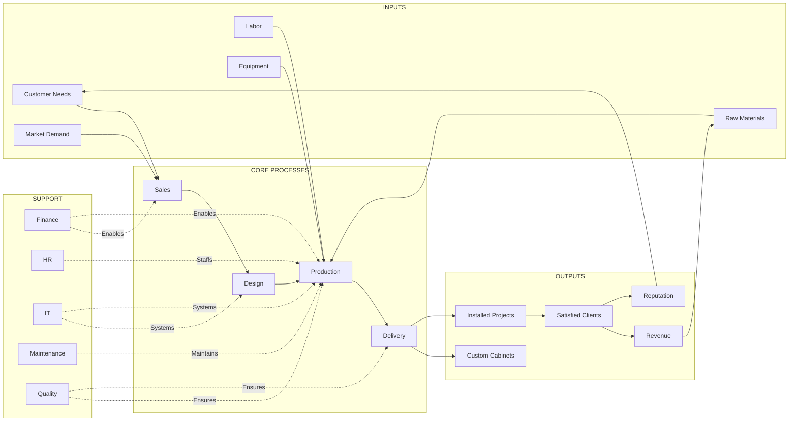
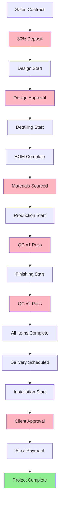
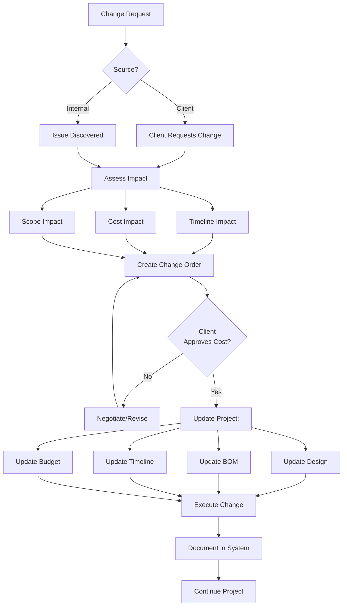

# TCS Woodwork - Business Process Flow Diagram
## Complete Business Operations Model

---

## 🏢 Complete Business Process Flow

```mermaid
flowchart TD
    subgraph Sales["💼 SALES & CLIENT MANAGEMENT"]
        S1[Lead Generation<br/>Marketing/Referrals] --> S2[Initial Inquiry]
        S2 --> S3[Qualification<br/>Budget/Timeline/Scope]
        S3 --> S4{Qualified<br/>Lead?}
        S4 -->|No| S5[Decline Politely]
        S4 -->|Yes| S6[Schedule Consultation]
        S6 --> S7[Site Visit & Measurements]
        S7 --> S8[Proposal Creation]
        S8 --> S9[Client Review]
        S9 --> S10{Client<br/>Approves?}
        S10 -->|No| S11[Revise Proposal]
        S11 --> S9
        S10 -->|Yes| S12[Contract Signed]
    end

    subgraph Finance["💰 FINANCIAL MANAGEMENT"]
        F1[Collect 30% Deposit] --> F2[Record in System]
        F2 --> F3[Allocate to Project Budget]
        F3 --> F4[Track Project Costs]
        F4 --> F5[Material Purchases]
        F4 --> F6[Labor Costs]
        F4 --> F7[Overhead Allocation]
        F5 --> F8[Budget Monitoring]
        F6 --> F8
        F7 --> F8
        F8 --> F9{Over<br/>Budget?}
        F9 -->|Yes| F10[Alert Bryan<br/>Review Options]
        F9 -->|No| F11[Continue Project]
        F10 --> F12[Client Change Order<br/>or Adjust Scope]
        F12 --> F3
    end

    subgraph Design["🎨 DESIGN & ENGINEERING"]
        D1[Create Project Folder] --> D2[Import Field Data]
        D2 --> D3[3D Modeling in Rhino]
        D3 --> D4[Room Layout Design]
        D4 --> D5[Cabinet Design]
        D5 --> D6[Material Selection]
        D6 --> D7[Hardware Selection]
        D7 --> D8[Generate Drawings]
        D8 --> D9[Client Review]
        D9 --> D10{Client<br/>Approves?}
        D10 -->|No| D11[Design Revisions]
        D11 --> D3
        D10 -->|Yes| D12[Finalize Design]
        D12 --> D13[Export DWG Files]
        D13 --> D14[Create Initial BOM]
    end

    subgraph Detail["📐 DETAILING & PLANNING"]
        DT1[Receive Design Files] --> DT2[Create Cabinet Specs]
        DT2 --> DT3[Face Frame Dimensions]
        DT2 --> DT4[Door/Drawer Specs]
        DT2 --> DT5[Hardware Calculations]
        DT3 --> DT6[Generate CNC Files]
        DT4 --> DT6
        DT5 --> DT6
        DT6 --> DT7[Create Cut Lists]
        DT7 --> DT8[Upload PDF Drawings]
        DT8 --> DT9[Assemble Job Cards]
        DT9 --> DT10[Quality Review]
        DT10 --> DT11{Complete?}
        DT11 -->|No| DT2
        DT11 -->|Yes| DT12[Release to Production]
    end

    subgraph Procurement["📦 PROCUREMENT & INVENTORY"]
        P1[Receive BOM] --> P2[Check Inventory Levels]
        P2 --> P3{Items<br/>in Stock?}
        P3 -->|All| P4[Allocate to Job]
        P3 -->|Partial/None| P5[Create Purchase Request]
        P5 --> P6[Add Pricing & Vendors]
        P6 --> P7[Submit for Approval]
        P7 --> P8{Bryan<br/>Approves?}
        P8 -->|No| P9[Revise/Defer]
        P9 --> P5
        P8 -->|Yes| P10[Process Purchase Order]
        P10 --> P11[Submit to Vendors]
        P11 --> P12[Track Deliveries]
        P12 --> P13[Receive Materials]
        P13 --> P14[Verify vs PO]
        P14 --> P15[Label with Job ID]
        P15 --> P16[Store in Location]
        P16 --> P17[Update Inventory]
        P17 --> P4
        P4 --> P18[Update Finalized BOM]
    end

    subgraph Production["🔨 PRODUCTION OPERATIONS"]
        PR1[Production Schedule] --> PR2[Assign Cabinet Runs]
        PR2 --> PR3[Team Lead Assignment]
        PR3 --> PR4[Verify Materials Ready]
        PR4 --> PR5{Materials<br/>Available?}
        PR5 -->|No| PR6[Request Materials]
        PR6 --> PR4
        PR5 -->|Yes| PR7[CNC Programming]
        PR7 --> PR8[CNC Cutting]
        PR8 --> PR9[Sort & Organize Parts]
        PR9 --> PR10[Cabinet Assembly]
        PR10 --> PR11[Face Frame Installation]
        PR11 --> PR12[Door/Drawer Install]
        PR12 --> PR13[Hardware Mounting]
        PR13 --> PR14[Self QC Check]
        PR14 --> PR15{Quality<br/>Pass?}
        PR15 -->|No| PR16[Rework Issues]
        PR16 --> PR14
        PR15 -->|Yes| PR17[QC Inspection #1]
        PR17 --> PR18{Aiden<br/>Approves?}
        PR18 -->|No| PR16
        PR18 -->|Yes| PR19[Update Task Status]
        PR19 --> PR20[Send to Finishing]
    end

    subgraph Finishing["🎨 FINISHING OPERATIONS"]
        FN1[Receive from Production] --> FN2[Check Finish Specs]
        FN2 --> FN3{Supplies<br/>Ready?}
        FN3 -->|No| FN4[Order Supplies]
        FN4 --> FN3
        FN3 -->|Yes| FN5[Prep Surface]
        FN5 --> FN6[Apply Finish]
        FN6 --> FN7[Drying Time]
        FN7 --> FN8[Additional Coats]
        FN8 --> FN9[Final Cure]
        FN9 --> FN10[QC Inspection #2]
        FN10 --> FN11{Aiden<br/>Approves?}
        FN11 -->|No| FN12[Strip/Refinish]
        FN12 --> FN5
        FN11 -->|Yes| FN13[Stage for Delivery]
    end

    subgraph Logistics["🚚 LOGISTICS & DELIVERY"]
        L1[All Items Complete] --> L2[Generate Bill of Lading]
        L2 --> L3[Schedule Transportation]
        L3 --> L4[Book Driver]
        L4 --> L5[Loading Day]
        L5 --> L6[Verify vs BOL]
        L6 --> L7{All Items<br/>Loaded?}
        L7 -->|No| L8[Find Missing Items]
        L8 --> L6
        L7 -->|Yes| L9[Secure Load]
        L9 --> L10[Depart to Site]
        L10 --> L11[Delivery Complete]
    end

    subgraph Installation["🏗️ INSTALLATION SERVICES"]
        I1[Site Arrival] --> I2[Unload & Inspect]
        I2 --> I3{Damage<br/>Found?}
        I3 -->|Yes| I4[Document & Report]
        I4 --> I5[Repair or Replace]
        I5 --> I2
        I3 -->|No| I6[Begin Installation]
        I6 --> I7[Layout Cabinets]
        I7 --> I8[Level & Secure]
        I8 --> I9[Install Countertops]
        I9 --> I10[Final Adjustments]
        I10 --> I11[Client Walkthrough]
        I11 --> I12{Client<br/>Satisfied?}
        I12 -->|No| I13[Create Punch List]
        I13 --> I14[Fix Issues]
        I14 --> I11
        I12 -->|Yes| I15[Project Completion]
    end

    subgraph Closeout["✅ PROJECT CLOSEOUT"]
        C1[Final Payment Collection] --> C2[Update Financial Records]
        C2 --> C3[Archive Project Files]
        C3 --> C4[30-Day Follow Up]
        C4 --> C5[Request Testimonial]
        C5 --> C6[Update Portfolio]
        C6 --> C7[Client Satisfaction Survey]
        C7 --> C8{Issues<br/>Found?}
        C8 -->|Yes| C9[Address Concerns]
        C9 --> C10[Warranty Service]
        C8 -->|No| C11[Mark Complete]
        C11 --> C12[Add to Referral List]
    end

    subgraph Quality["⭐ QUALITY MANAGEMENT"]
        Q1[Quality Standards] --> Q2[Training Programs]
        Q2 --> Q3[Work Instructions]
        Q3 --> Q4[QC Checkpoints]
        Q4 --> Q5[Inspection Records]
        Q5 --> Q6[Defect Tracking]
        Q6 --> Q7[Corrective Actions]
        Q7 --> Q8[Process Improvements]
        Q8 --> Q1
    end

    subgraph Support["🛠️ SUPPORT PROCESSES"]
        SP1[HR & Staffing] --> SP2[Equipment Maintenance]
        SP2 --> SP3[Tool Management]
        SP3 --> SP4[Facility Management]
        SP4 --> SP5[IT Systems]
        SP5 --> SP6[Safety Programs]
    end

    %% Flow between major processes
    S12 --> F1
    S12 --> D1
    F1 --> D1
    D14 --> DT1
    DT12 --> P1
    P18 --> PR1
    PR20 --> FN1
    FN13 --> L1
    L11 --> I1
    I15 --> C1

    %% Quality touchpoints
    Q4 -.->|Inspects| PR17
    Q4 -.->|Inspects| FN10
    Q4 -.->|Monitors| I11

    %% Support processes
    SP5 -.->|Enables| D3
    SP5 -.->|Enables| DT6
    SP5 -.->|Enables| PR7
    SP2 -.->|Maintains| PR8
    SP6 -.->|Ensures| PR10

    style S12 fill:#90EE90
    style F1 fill:#90EE90
    style D12 fill:#FFD700
    style DT12 fill:#FFD700
    style P18 fill:#90EE90
    style PR19 fill:#FFD700
    style FN13 fill:#90EE90
    style L11 fill:#FFD700
    style I15 fill:#90EE90
    style C11 fill:#FFD700
```



---

## 📊 Process Ownership Matrix

| Process | Owner | Backup | Key Metrics |
|---------|-------|--------|-------------|
| **Sales & Client Management** | Bryan | - | Lead conversion rate, proposal win rate |
| **Financial Management** | Sadie | Bryan | Budget variance, cash flow |
| **Design & Engineering** | Bryan | - | Design revisions, client approval time |
| **Detailing & Planning** | Aiden | Bryan | Job card accuracy, spec completeness |
| **Procurement & Inventory** | Aiden/Sadie | - | On-time delivery, inventory accuracy |
| **Production Operations** | Levi/Shaggy | - | Production time, QC pass rate |
| **Finishing Operations** | Finishing Team | - | Finish quality, rework rate |
| **Logistics & Delivery** | Aiden/Chase | - | On-time delivery, damage rate |
| **Installation Services** | Chase | - | Installation time, client satisfaction |
| **Project Closeout** | Bryan | - | Payment collection, client satisfaction |
| **Quality Management** | Aiden | Bryan | Defect rate, rework percentage |

---

## 🔄 Key Process Interfaces



---

## 📈 Process Performance Metrics

### Sales Process KPIs
- Lead response time: < 24 hours
- Proposal turnaround: 3-5 days
- Win rate: 40-60%
- Average project value: Track monthly

### Operations KPIs
- On-time production: > 90%
- QC pass rate (first time): > 95%
- Material waste: < 5%
- Rework rate: < 3%

### Financial KPIs
- Deposit collection: 100% before design
- Budget variance: ± 5%
- Cash flow: Positive monthly
- Profitability per project: Track actual vs estimate

### Quality KPIs
- Customer satisfaction: > 90%
- Defect rate: < 2%
- Warranty claims: < 1%
- Repeat customer rate: > 30%

### Delivery KPIs
- On-time delivery: > 95%
- Damage rate: < 1%
- Complete shipments: > 98%
- Installation completion time: Per estimate

---

## 🔄 Process Dependencies



**Legend:**
- 🔴 Pink = Critical Gates (Cannot proceed without)
- 🟢 Green = Project Complete

---

## 📋 Process Checklist by Role

### Bryan (Operations Manager)
- [ ] Review and approve all proposals
- [ ] Complete design in Rhino
- [ ] Approve all purchase orders
- [ ] Assign cabinet runs to production leads
- [ ] Review project budgets weekly
- [ ] Handle client communications
- [ ] Resolve design issues

### Aiden (Detailer/Warehouse/QC)
- [ ] Create detailed specifications
- [ ] Generate CNC files and cut lists
- [ ] Check inventory levels (weekly)
- [ ] Create purchase requests
- [ ] Receive and label materials
- [ ] Perform QC inspections (2x per job)
- [ ] Organize warehouse (Fridays)
- [ ] Stage materials for production

### Sadie (Inventory/Purchasing/Finance)
- [ ] Process approved purchase orders
- [ ] Track vendor deliveries
- [ ] Monitor project budgets
- [ ] Record deposits and payments
- [ ] Weekly PO review with Bryan (Mondays)
- [ ] Maintain vendor relationships
- [ ] Update financial records

### Levi/Shaggy (Production Leads)
- [ ] Receive cabinet run assignments
- [ ] Verify materials available
- [ ] Assign tasks to crew
- [ ] Build cabinets per specifications
- [ ] Self-check quality before QC
- [ ] Update task status
- [ ] Train new team members
- [ ] Report issues to Bryan/Aiden

### Dagger (CNC Operator)
- [ ] Load CNC files from USB
- [ ] Program CNC in V-Carve
- [ ] Run CNC machine
- [ ] Quality check cut parts
- [ ] Draw files while machine runs
- [ ] Coordinate with production team
- [ ] Maintain CNC equipment

### Chase (Installation Lead)
- [ ] Receive delivery on-site
- [ ] Inspect for damage
- [ ] Layout cabinets per drawings
- [ ] Install and secure cabinets
- [ ] Install countertops
- [ ] Client walkthrough
- [ ] Create punch list if needed
- [ ] Collect final payment

---

## 🎯 Critical Success Factors

### Must Have for Business Success
1. ✅ **Deposit before design** - Protects time investment
2. ✅ **Complete BOM before production** - Prevents delays
3. ✅ **QC at 2 checkpoints** - Ensures quality
4. ✅ **Client approval at key milestones** - Prevents rework
5. ✅ **Materials ready before production** - Smooth workflow
6. ✅ **Communication between phases** - No missing information
7. ✅ **Budget monitoring** - Protects profitability

### Key Process Controls
- **Financial Gate:** No design without deposit
- **Materials Gate:** No production without complete BOM
- **Quality Gate #1:** No finishing without QC pass
- **Quality Gate #2:** No delivery without QC pass
- **Client Gate:** No installation without client approval
- **Payment Gate:** Final payment before closeout

---

## 📞 Escalation Paths

### Production Issues
```
Production Team → Levi/Shaggy → Bryan
```

### Quality Issues
```
Production Team → Aiden (QC) → Bryan
```

### Material Issues
```
Production Team → Aiden (Warehouse) → Sadie → Bryan
```

### Client Issues
```
Any Team Member → Bryan (immediate)
```

### Safety Issues
```
Anyone → Everyone (immediate stop work)
```

---

## 🔄 Change Management Process

When changes occur during project:



---

## 📊 Monthly Business Review Checklist

### Financial Review
- [ ] Revenue vs target
- [ ] Profit margin by project
- [ ] Cash flow analysis
- [ ] Outstanding invoices
- [ ] Budget variances

### Operations Review
- [ ] Projects in pipeline
- [ ] Production capacity utilization
- [ ] Lead times actual vs target
- [ ] Material costs trending
- [ ] Labor efficiency

### Quality Review
- [ ] Customer satisfaction scores
- [ ] Defect rates
- [ ] Rework percentages
- [ ] Warranty claims
- [ ] QC pass rates

### Team Review
- [ ] Staffing levels
- [ ] Training completed
- [ ] Safety incidents
- [ ] Team performance
- [ ] Skill gaps identified

---

**Document Purpose:** Master reference for all business processes
**Owner:** Bryan (Operations Manager)
**Review Frequency:** Quarterly
**Last Updated:** November 21, 2025
