# TCS Woodwork - Complete Process Decision Tree
## Discovery → Delivery → Installation

```mermaid
flowchart TD
    Start([Customer Inquiry]) --> InitMeeting[Initial Meeting<br/>Bryan + Client]

    InitMeeting --> SiteVisit[Site Visit &<br/>Measurements]

    SiteVisit --> CreateFolder[Create Project Folder<br/>Assign Job Number]

    CreateFolder --> Proposal[Create Proposal<br/>Bryan + Andrew]

    Proposal --> SendProposal[Send to Client]

    SendProposal --> ClientApprove{Client<br/>Approves?}

    ClientApprove -->|No| ReviseProposal[Revise Proposal]
    ReviseProposal --> SendProposal

    ClientApprove -->|Yes| Deposit[Collect 30% Deposit]

    Deposit --> DepositCheck{Deposit<br/>Received?}
    DepositCheck -->|No| FollowUp[Follow Up Payment]
    FollowUp --> DepositCheck

    DepositCheck -->|Yes| RhinoDesign[Design in Rhino<br/>Bryan]

    RhinoDesign --> ModelRoom[Model Room Layout]
    ModelRoom --> DesignCabinets[Design Cabinets]
    DesignCabinets --> SelectMaterials[Select Materials,<br/>Hardware, Finishes]

    SelectMaterials --> ExportFiles[Export DWG Files<br/>Generate PDFs]
    ExportFiles --> InitialBOM[Create Initial BOM]

    InitialBOM --> DesignReview{Bryan<br/>Reviews Design?}
    DesignReview -->|Changes Needed| RhinoDesign

    DesignReview -->|Approved| ToDetailing[Hand to Detailing]

    ToDetailing --> AidenReceives[Aiden Receives:<br/>Rhino, DWG, Job Spec]

    AidenReceives --> CabinetSpecs[Create Cabinet<br/>Specifications]

    CabinetSpecs --> FaceFrameSpecs[Face Frame<br/>Dimension Drawings]
    CabinetSpecs --> DoorSpecs[Door/Drawer<br/>Dimension Drawings]
    CabinetSpecs --> CNCFiles[Generate CNC Files]
    CabinetSpecs --> CutLists[Create Cut Lists]

    FaceFrameSpecs --> AssembleJobCard[Assemble Job Card Bundle]
    DoorSpecs --> AssembleJobCard
    CNCFiles --> AssembleJobCard
    CutLists --> AssembleJobCard

    AssembleJobCard --> DetailingComplete{All Specs<br/>Complete?}
    DetailingComplete -->|No| CabinetSpecs

    DetailingComplete -->|Yes| SendBOM[Send BOM to<br/>Inventory Check]

    SendBOM --> AidenInventory[Aiden Checks<br/>Current Inventory]

    AidenInventory --> ItemLoop{For Each<br/>BOM Item}

    ItemLoop --> CheckStock{In Stock?}

    CheckStock -->|Yes| AllocateItem[Allocate to Job<br/>Label with Job ID]
    AllocateItem --> UpdateMaster1[Update Master<br/>Inventory]
    UpdateMaster1 --> NextItem1{More<br/>Items?}
    NextItem1 -->|Yes| ItemLoop

    CheckStock -->|No| CreatePORequest[Create Purchase<br/>Order Request]
    CreatePORequest --> SadieCompile[Sadie Adds Pricing<br/>& Vendor Info]

    SadieCompile --> BryanPOReview[Bryan Reviews PO]

    BryanPOReview --> CheckBudget{Within<br/>Budget?}
    CheckBudget -->|No| RejectPO[Reject/Modify PO]
    RejectPO --> CreatePORequest

    CheckBudget -->|Yes| CheckBOM{Matches<br/>BOM?}
    CheckBOM -->|No| QuestionQty[Question Quantities]
    QuestionQty --> CreatePORequest

    CheckBOM -->|Yes| BryanApprove[Bryan Approves]

    BryanApprove --> SadieProcess[Sadie Processes<br/>Purchase Order]
    SadieProcess --> SubmitVendor[Submit to Vendor]
    SubmitVendor --> ScheduleDelivery[Schedule Delivery<br/>Wednesday Target]

    ScheduleDelivery --> WaitDelivery[Wait for Delivery]
    WaitDelivery --> DeliveryArrives[Materials Arrive]

    DeliveryArrives --> AidenReceiveMat[Aiden Receives<br/>& Verifies vs PO]

    AidenReceiveMat --> VerifyQty{Quantities<br/>Correct?}
    VerifyQty -->|No| ContactVendor[Contact Vendor<br/>for Missing Items]
    ContactVendor --> WaitDelivery

    VerifyQty -->|Yes| LabelMaterials[Label with Job ID]

    LabelMaterials --> MaterialType{Material<br/>Type?}

    MaterialType -->|Hardware| JobBox[Put in Job-Specific<br/>Box - ALLOCATED]
    MaterialType -->|Sheet Goods| BayStorage[Label & Store<br/>in Designated Bay]
    MaterialType -->|Bulk Stock| BulkArea[Store in Bulk<br/>Stock Area]

    JobBox --> UpdateInventory2[Update Master<br/>Inventory]
    BayStorage --> UpdateInventory2
    BulkArea --> UpdateInventory2

    UpdateInventory2 --> NextItem2{More<br/>Items?}
    NextItem2 -->|Yes| ItemLoop

    NextItem1 -->|No| AllItemsReady[All BOM Items<br/>Accounted For]
    NextItem2 -->|No| AllItemsReady

    AllItemsReady --> UpdateFinalBOM[Update Finalized BOM<br/>with Locations]

    UpdateFinalBOM --> SourcingComplete[Sourcing Complete]

    SourcingComplete --> BryanAssign[Bryan Assigns<br/>Cabinet Run to Team Lead]

    BryanAssign --> WhichLead{Assign<br/>To?}
    WhichLead -->|Levi| LeviReceives[Levi Receives<br/>Job Card Bundle]
    WhichLead -->|Shaggy| ShaggyReceives[Shaggy Receives<br/>Job Card Bundle]

    LeviReceives --> VerifyMats1[Verify Materials<br/>Check Finalized BOM]
    ShaggyReceives --> VerifyMats2[Verify Materials<br/>Check Finalized BOM]

    VerifyMats1 --> MatCheck1{All Materials<br/>Available?}
    VerifyMats2 --> MatCheck2{All Materials<br/>Available?}

    MatCheck1 -->|No| ReportMissing1[Report Missing<br/>to Aiden]
    MatCheck2 -->|No| ReportMissing2[Report Missing<br/>to Aiden]
    ReportMissing1 --> CreatePORequest
    ReportMissing2 --> CreatePORequest

    MatCheck1 -->|Yes| NotifyCNC1[Notify CNC Operator<br/>Dagger]
    MatCheck2 -->|Yes| NotifyCNC2[Notify CNC Operator<br/>Dagger]

    NotifyCNC1 --> DaggerPrep[Dagger Gets Sheets<br/>& Loads CNC Files]
    NotifyCNC2 --> DaggerPrep

    DaggerPrep --> DaggerProgram[Dagger Programs<br/>CNC in V-Carve]

    DaggerProgram --> RunCNC[Run CNC Machine<br/>Cut Parts]

    RunCNC --> AidenSorts[Aiden Sorts &<br/>Organizes Parts]

    AidenSorts --> TeamBuilds[Team Assembles<br/>Cabinet Boxes]

    TeamBuilds --> FaceFrameBuild[Build & Install<br/>Face Frames]

    FaceFrameBuild --> DoorsDrawers[Install Doors,<br/>Drawers, Shelves]

    DoorsDrawers --> InstallHardware[Install Hardware<br/>Hinges, Slides]

    InstallHardware --> UpdateTaskStatus[Update Task Status<br/>in System]

    UpdateTaskStatus --> QC1Check[QC Checkpoint #1<br/>Aiden Inspects]

    QC1Check --> QC1Pass{Passes<br/>Quality?}

    QC1Pass -->|No| IdentifyIssues[Identify Issues]
    IdentifyIssues --> ReworkDecision{Can<br/>Rework?}
    ReworkDecision -->|Yes| Rework[Fix Issues]
    Rework --> QC1Check
    ReworkDecision -->|No| Rebuild[Rebuild Component]
    Rebuild --> TeamBuilds

    QC1Pass -->|Yes| SendToFinish[Send to Finishing<br/>with Quantity List]

    SendToFinish --> FinishReceive[Finishing Receives<br/>Parts]

    FinishReceive --> CheckFinishSpec[Check Finish<br/>Specifications]

    CheckFinishSpec --> SuppliesReady{Supplies<br/>Ready?}
    SuppliesReady -->|No| OrderSupplies[Aiden/Sadie<br/>Order Supplies]
    OrderSupplies --> SuppliesReady

    SuppliesReady -->|Yes| ApplyFinish[Apply Finish<br/>Stain/Paint]

    ApplyFinish --> DryTime[Drying Time]

    DryTime --> QC2Check[QC Checkpoint #2<br/>Aiden Inspects]

    QC2Check --> QC2Pass{Passes<br/>Quality?}

    QC2Pass -->|No| FinishIssue{Issue<br/>Type?}
    FinishIssue -->|Fixable| TouchUp[Touch Up<br/>Finish]
    TouchUp --> QC2Check
    FinishIssue -->|Strip & Redo| StripFinish[Strip Finish]
    StripFinish --> ApplyFinish

    QC2Pass -->|Yes| StageDelivery[Stage for Delivery<br/>in Warehouse]

    StageDelivery --> AllCabsFinished{All Cabinets<br/>for Job Done?}

    AllCabsFinished -->|No| WaitMore[Wait for<br/>More Cabinets]
    WaitMore --> StageDelivery

    AllCabsFinished -->|Yes| PrepDelivery[Prepare for Delivery]

    PrepDelivery --> TrackParts[Track All Parts<br/>Going to Trailer]

    TrackParts --> GenerateBOL[Generate Bill<br/>of Lading]

    GenerateBOL --> BOLComplete{BOL<br/>Complete?}
    BOLComplete -->|No| AddMissing[Add Missing Items]
    AddMissing --> TrackParts

    BOLComplete -->|Yes| BookTransport[Book Transportation<br/>Cape Cod Express]

    BookTransport --> AssignDriver[Assign Driver]

    AssignDriver --> LoadDay[Loading Day]

    LoadDay --> AidenLoads[Aiden Assists<br/>Loading Trailer]

    AidenLoads --> CheckBOL[Check Items<br/>vs BOL]

    CheckBOL --> AllLoaded{All Items<br/>Loaded?}
    AllLoaded -->|No| FindMissing[Find Missing<br/>Items]
    FindMissing --> AidenLoads

    AllLoaded -->|Yes| SecureLoad[Secure Load<br/>for Transport]

    SecureLoad --> DriverDeparts[Driver Departs<br/>to Site]

    DriverDeparts --> SiteArrival[Arrive at Site]

    SiteArrival --> ChaseReceives[Chase Receives<br/>Delivery]

    ChaseReceives --> UnloadInspect[Unload &<br/>Inspect Items]

    UnloadInspect --> DamageCheck{Any<br/>Damage?}
    DamageCheck -->|Yes| DocumentDamage[Document Damage<br/>Photos]
    DocumentDamage --> ContactBryan[Contact Bryan<br/>for Resolution]
    ContactBamage --> RepairDecision{Can<br/>Repair on Site?}
    RepairDecision -->|Yes| RepairOnSite[Repair Damaged<br/>Item]
    RepairDecision -->|No| OrderReplacement[Order Replacement<br/>from Shop]
    OrderReplacement --> WaitReplacement[Wait for<br/>Replacement]
    WaitReplacement --> SiteArrival

    DamageCheck -->|No| StartInstall[Begin Installation]
    RepairOnSite --> StartInstall

    StartInstall --> UsePDFs[Use PDF Drawings<br/>for Placement]

    UsePDFs --> LayoutCabinets[Layout Cabinet<br/>Positions]

    LayoutCabinets --> LevelCheck{Level &<br/>Plumb?}
    LevelCheck -->|No| ShimAdjust[Shim & Adjust]
    ShimAdjust --> LevelCheck

    LevelCheck -->|Yes| SecureCabinets[Secure Cabinets<br/>to Wall/Floor]

    SecureCabinets --> InstallCountertop{Countertop<br/>Included?}
    InstallCountertop -->|Yes| MeasureCounter[Measure for<br/>Countertop]
    MeasureCounter --> FabricatorOrder[Order from<br/>Fabricator]
    FabricatorOrder --> InstallCounter[Install Countertop]
    InstallCounter --> FinalAdjust

    InstallCountertop -->|No| FinalAdjust[Final Adjustments<br/>Doors, Drawers]

    FinalAdjust --> ClientWalkthrough[Client Walkthrough<br/>with Chase]

    ClientWalkthrough --> ClientSatisfied{Client<br/>Satisfied?}

    ClientSatisfied -->|No| PunchList[Create Punch List<br/>of Issues]
    PunchList --> FixIssues[Fix Issues]
    FixIssues --> ClientWalkthrough

    ClientSatisfied -->|Yes| FinalPayment[Collect Final<br/>Payment]

    FinalPayment --> ProjectComplete([PROJECT<br/>COMPLETE])

    ProjectComplete --> FollowUp[30-Day Follow Up<br/>Call]

    FollowUp --> Archive[Archive Project<br/>Files]

    ContactBryan[Contact Bryan<br/>for Resolution]

    style Start fill:#e1f5ff
    style Deposit fill:#90EE90
    style BryanApprove fill:#90EE90
    style QC1Pass fill:#FFD700
    style QC2Pass fill:#FFD700
    style ClientSatisfied fill:#90EE90
    style ProjectComplete fill:#FFD700
    style RejectPO fill:#FFB6C1
    style Rework fill:#FFB6C1
    style StripFinish fill:#FFB6C1
    style DocumentDamage fill:#FFB6C1
```

---

## Legend

### Decision Points (Diamonds)
- **Client Approves?** - Proposal approval gate
- **Deposit Received?** - Financial gate
- **In Stock?** - Inventory availability check
- **Within Budget?** - Financial control
- **Passes Quality?** - QC checkpoints (2x)
- **All Items Loaded?** - Delivery verification
- **Any Damage?** - Installation inspection
- **Client Satisfied?** - Final acceptance

### Key Roles
- **Bryan** - Operations Manager (approvals, design, assignments)
- **Andrew** - Systems Consultant (proposals, system design)
- **Aiden** - Detailer, Warehouse Manager, QC Inspector
- **Sadie** - Inventory, Purchasing, Finance
- **Dagger** - CNC Operator
- **Levi/Shaggy** - Production Team Leads
- **Alina** - Production Helper
- **Chase** - Installation Lead

### Color Coding
- 🔵 **Blue** - Start/Entry points
- 🟢 **Green** - Approval/Success points
- 🟡 **Yellow** - Major milestones
- 🔴 **Pink** - Issues/Rework required

### Critical Gates (Cannot Proceed Without)
1. ✅ Client approval + 30% deposit
2. ✅ Complete BOM with all items sourced
3. ✅ QC Checkpoint #1 pass
4. ✅ QC Checkpoint #2 pass
5. ✅ All items loaded & verified vs BOL
6. ✅ Client walkthrough satisfaction

---

**Process Duration:** ~4-12 weeks depending on project complexity
**Total Decision Points:** 28 major checkpoints
**Quality Gates:** 2 mandatory QC inspections
**Financial Gates:** 2 (deposit collection + budget approvals)
