# New Employee Workflow Guide
## Understanding TCS Woodwork's Complete Process

**Welcome to TCS Woodwork!** This guide explains how custom cabinet projects flow through our company from start to finish, and where YOU fit into the process.

---

## 🏢 The Big Picture - How Projects Flow

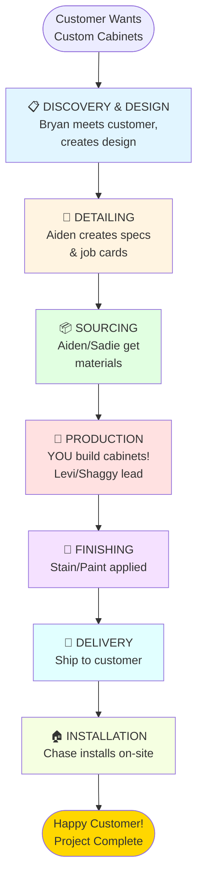

---

## 👥 Who Does What? - Meet Your Team

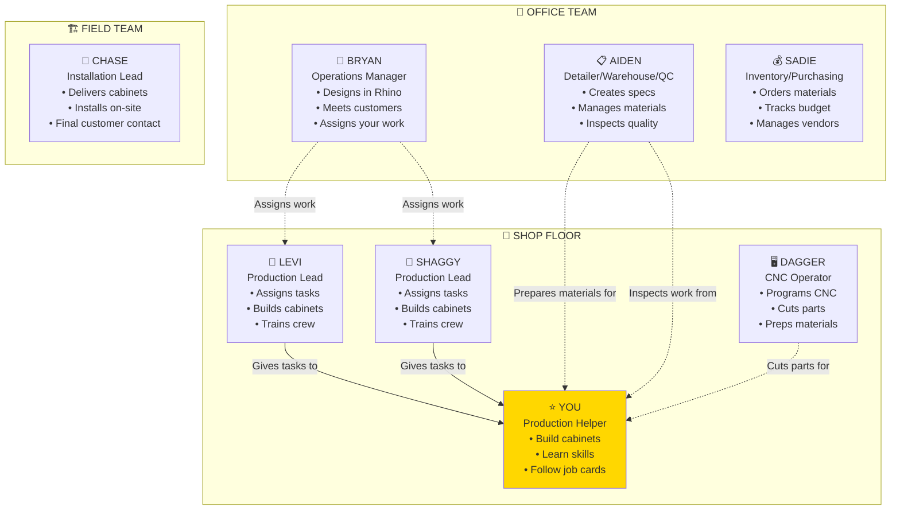

---

## 📅 Your Daily Work - What to Expect

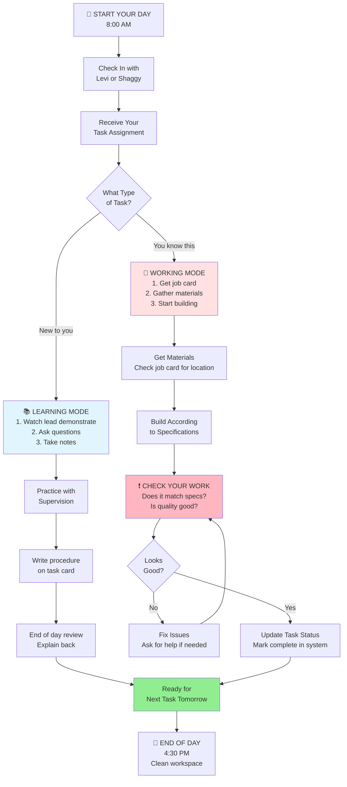

---

## 📋 Understanding Your Job Card

**What is it?** A packet of information telling you exactly what to build and how.

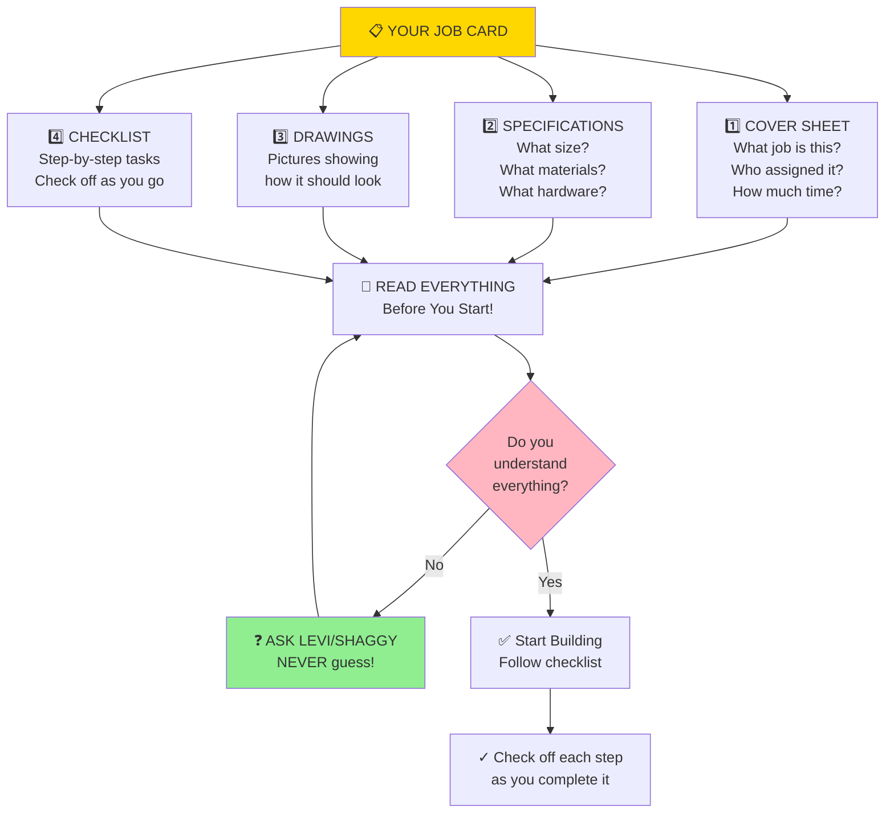

---

## 🔨 Production Process - Your Role in Detail

```mermaid
flowchart TD
    Assignment[You Receive<br/>Cabinet Run Assignment] --> Materials[Step 1:<br/>GATHER MATERIALS]

    Materials --> FindMat[Check job card for<br/>material locations]
    FindMat --> GetSheets[Get sheet goods<br/>from labeled bay]
    FindMat --> GetHardware[Get hardware from<br/>job-specific box]
    FindMat --> GetLumber[Get lumber if needed]

    GetSheets --> Verify[✓ Verify you have<br/>everything on list]
    GetHardware --> Verify
    GetLumber --> Verify

    Verify --> AllThere{Everything<br/>there?}
    AllThere -->|No| TellAiden[Tell Aiden<br/>something is missing]
    TellAiden --> WaitMaterial[Wait for materials<br/>Work on different task]

    AllThere -->|Yes| CNCCheck{Does job<br/>need CNC<br/>parts?}

    CNCCheck -->|Yes| WaitDagger[Wait for Dagger<br/>to cut CNC parts]
    WaitDagger --> DaggerCuts[Dagger cuts parts<br/>on CNC machine]
    DaggerCuts --> AidenSorts[Aiden sorts &<br/>labels parts for you]
    AidenSorts --> GetCNCParts[Collect your<br/>CNC parts]

    CNCCheck -->|No| StartBuild[Step 2:<br/>START BUILDING]
    GetCNCParts --> StartBuild

    StartBuild --> BuildBox[Build Cabinet Box<br/>Follow dimensions]
    BuildBox --> FaceFrame[Build & Attach<br/>Face Frame]
    FaceFrame --> Doors[Install Doors<br/>with hinges]
    Doors --> Drawers[Install Drawer Boxes<br/>& Slides]
    Drawers --> Shelves[Install Shelves<br/>Adjustable or fixed]
    Shelves --> Hardware[Install All Hardware<br/>Knobs, pulls, etc.]

    Hardware --> SelfQC[Step 3:<br/>SELF-CHECK QUALITY]

    SelfQC --> CheckList{Check ALL:<br/>□ Dimensions correct?<br/>□ Square & level?<br/>□ Smooth finish?<br/>□ Hardware works?<br/>□ Doors/drawers open smoothly?}

    CheckList -->|Something wrong| FixIt[Fix the issue<br/>Ask for help if needed]
    FixIt --> SelfQC

    CheckList -->|All good!| CallAiden[Step 4:<br/>Call Aiden for<br/>QC INSPECTION #1]

    CallAiden --> AidenInspects[Aiden Inspects<br/>Your Work]

    AidenInspects --> AidenDecision{Aiden<br/>Approves?}

    AidenDecision -->|No| AidenExplains[Aiden explains<br/>what needs fixing]
    AidenExplains --> FixIt

    AidenDecision -->|Yes| Approved[✅ APPROVED!<br/>Good job!]

    Approved --> UpdateSystem[Update task status<br/>Mark as complete]
    UpdateSystem --> ToFinishing[Cabinet goes to<br/>Finishing department]

    ToFinishing --> YourDone[✨ YOU'RE DONE<br/>WITH THIS TASK!]

    YourDone --> NextAssignment[Ready for next<br/>assignment from<br/>Levi/Shaggy]

    style SelfQC fill:#FFB6C1
    style CallAiden fill:#FFD700
    style Approved fill:#90EE90
    style YourDone fill:#90EE90
```

---

## 🎓 Learning Mode - How Training Works

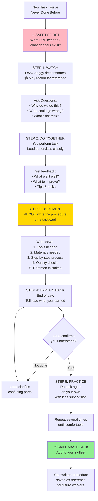

---

## 🎯 Quality Standards - What "Good" Looks Like

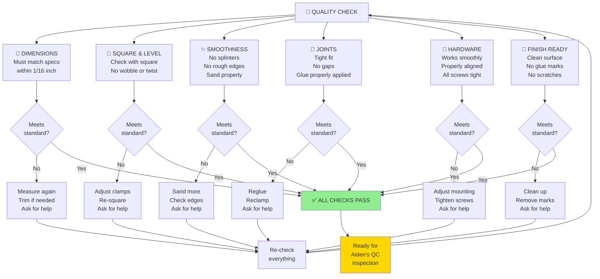

---

## 📦 Material Flow - Where to Find Things

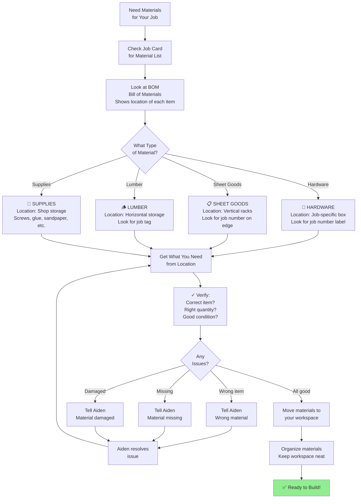

---

## ⚠️ Important Rules - Never Skip These!

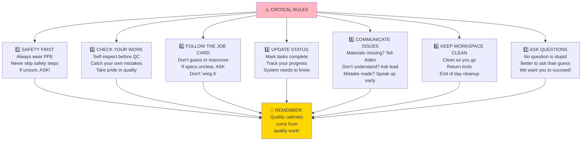

---

## 🚀 Your Growth Path - Week by Week

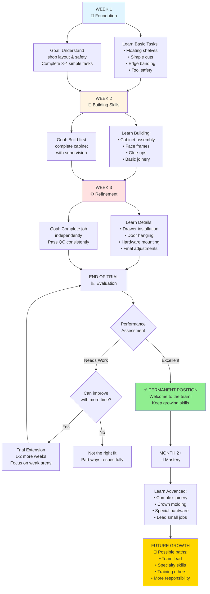

---

## 💬 Key Phrases You'll Hear

| Phrase | What It Means |
|--------|---------------|
| **"BOM"** | Bill of Materials - list of everything needed for a job |
| **"Job Card"** | Your instruction packet for a task |
| **"Linear Feet"** | How we measure and price cabinet runs (width of cabinets) |
| **"Face Frame"** | The front frame that doors attach to |
| **"Cabinet Run"** | A group of cabinets along one wall or area |
| **"QC"** | Quality Control - Aiden inspects your work |
| **"CNC"** | Computer-controlled cutting machine (Dagger runs it) |
| **"Finalized BOM"** | Materials list with warehouse locations added |
| **"Allocated"** | Materials assigned to a specific job (don't touch!) |
| **"Job Box"** | Box containing hardware for a specific job |
| **"Rhino"** | Design software Bryan uses |
| **"Chase job"** | Work going out to installation soon |

---

## 📞 Who to Ask When...

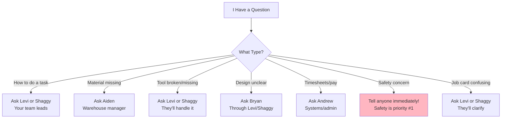

---

## 🎯 Success Tips - How to Excel

### DO ✅
- ✅ Ask questions when unsure
- ✅ Check your work before QC
- ✅ Keep your workspace organized
- ✅ Follow job cards exactly
- ✅ Communicate problems early
- ✅ Take notes on new skills
- ✅ Show up on time
- ✅ Be willing to learn
- ✅ Take pride in quality
- ✅ Help keep shop clean

### DON'T ❌
- ❌ Guess when you don't know
- ❌ Skip safety equipment
- ❌ Rush through work
- ❌ Hide mistakes
- ❌ Use materials from other jobs
- ❌ Leave workspace messy
- ❌ Ignore quality issues
- ❌ Be afraid to ask for help
- ❌ Take shortcuts
- ❌ Forget to update task status

---

## 📚 Your First Day Checklist

- [ ] Tour of shop (where everything is)
- [ ] Safety equipment location
- [ ] Timesheet system explained
- [ ] Introduction to job cards
- [ ] Meet all team members
- [ ] Learn shop cleanup routine
- [ ] Practice first simple task
- [ ] Write your first procedure
- [ ] End-of-day review with lead
- [ ] Questions answered

---

**Remember:** Everyone started where you are now. We want you to succeed! The key is asking questions, following procedures, and taking pride in your work.

**Good luck and welcome to the team! 🎉**

---

**Document Created:** November 21, 2025
**For:** New Production Team Members
**Your Success = Our Success!**
