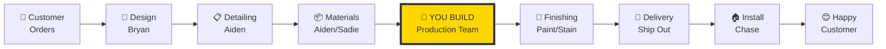
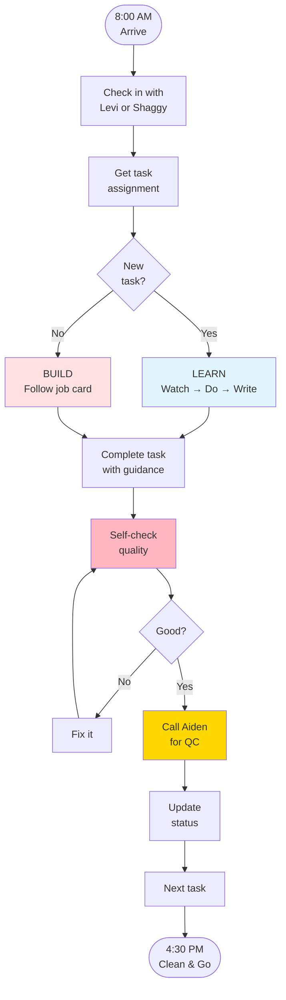
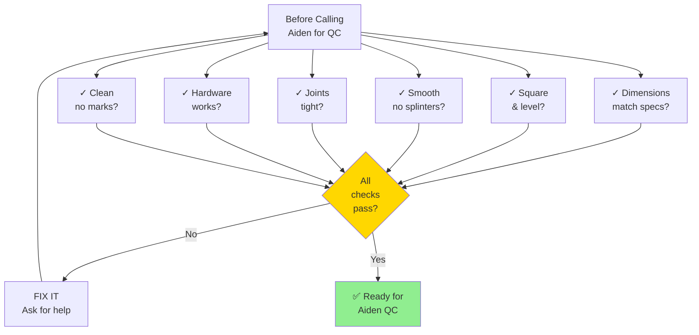
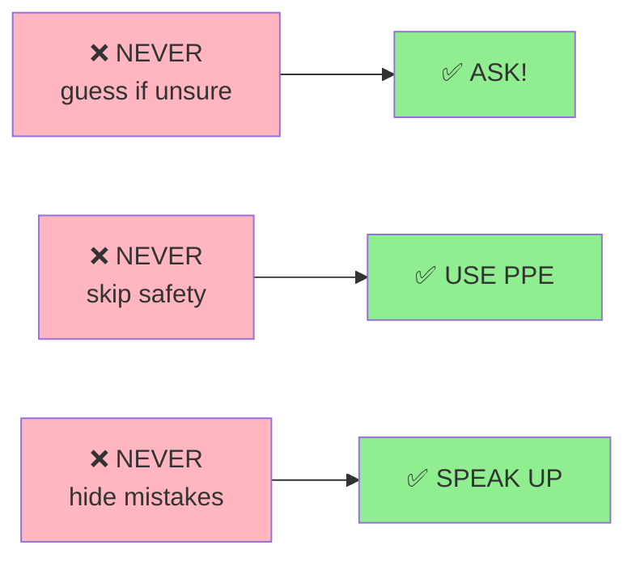
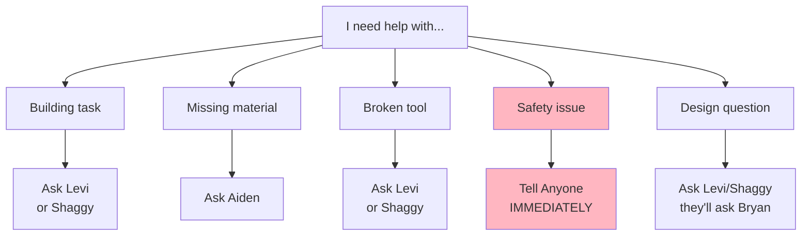

# Shop Floor Quick Reference
## One-Page Visual Guide for Production Team

**Print this and post it in the shop!**

---

## 🔄 The Complete Process (Where Your Work Fits)

---

## 📋 Your Daily Workflow

---

## 🎯 Quality Checklist (Check EVERY Time!)

---

## 📦 Where to Find Materials

| Material Type | Where to Look | How to Identify |
|--------------|---------------|-----------------|
| **🔩 Hardware** | Job-specific boxes | Look for job number label |
| **📋 Sheet Goods** | Vertical racks | Job number on edge |
| **🪵 Lumber** | Horizontal storage | Job tag attached |
| **🧰 Supplies** | Shop storage | General use items |

**RULE:** If you can't find it, ask Aiden immediately!

---

## ⚠️ THE 3 NEVER RULES

---

## 💬 Quick Vocabulary

| Term | Meaning |
|------|---------|
| **BOM** | Bill of Materials (what you need) |
| **Job Card** | Your instructions |
| **QC** | Quality Check (Aiden inspects) |
| **Face Frame** | Front frame on cabinet |
| **Linear Feet** | How we measure cabinet width |
| **Allocated** | Assigned to a job (don't use!) |

---

## 📞 Who to Ask

---

## ✅ End of Day Checklist

- [ ] All tasks marked complete in system
- [ ] Tools returned to proper place
- [ ] Workspace cleaned and swept
- [ ] Scraps in bin, not on floor
- [ ] Any issues reported to lead
- [ ] Ready for tomorrow

---

## 🎯 Remember

**QUALITY > SPEED**

Take your time. Do it right. Ask questions. Check your work.

We'd rather you ask 100 questions than make 1 mistake!

---

**Print Date:** _______________
**Posted Location:** Shop Floor
**Questions?** Ask Levi, Shaggy, or Aiden
