# TCS Woodwork ERP - Complete Workflow Diagrams

## 📋 Table of Contents
1. [Complete End-to-End Workflow](#complete-end-to-end-workflow)
2. [Discovery & Design Phase](#discovery--design-phase)
3. [Detailing Phase](#detailing-phase)
4. [Sourcing & Procurement](#sourcing--procurement)
5. [Production Workflow](#production-workflow)
6. [Quality Control & Delivery](#quality-control--delivery)
7. [Data Hierarchy Structure](#data-hierarchy-structure)
8. [Role Responsibilities](#role-responsibilities)
9. [Linear Feet Calculation](#linear-feet-calculation)
10. [Inventory Management](#inventory-management)

---

## Complete End-to-End Workflow

---

## Discovery & Design Phase

---

## Detailing Phase

---

## Sourcing & Procurement

---

## Production Workflow

---

## Quality Control & Delivery

---

## Data Hierarchy Structure

```mermaid
graph TD
    Project[PROJECT<br/>Job #, Customer, Budget] --> Room1[ROOM: Kitchen]
    Project --> Room2[ROOM: Bathroom]

    Room1 --> RoomLoc1[ROOM LOCATION: Wall]
    Room1 --> RoomLoc2[ROOM LOCATION: Island]

    RoomLoc1 --> Run1[CABINET RUN: Base]
    RoomLoc1 --> Run2[CABINET RUN: Upper]
    RoomLoc2 --> Run3[CABINET RUN: Full-Height]

    Run1 --> RunInfo1[Linear Feet: Auto-calc<br/>Materials: Defaults<br/>Hardware: Defaults<br/>Countertop: Specs]

    Run1 --> Cab1[CABINET: K1-B01<br/>Overall: H×W×D<br/>Face Frame Type<br/>Toe Kick<br/>End Panels]
    Run1 --> Cab2[CABINET: K1-B02]

    Cab1 --> Door1[DOOR<br/>Profile, Dimensions<br/>Hardware, Hinges]
    Cab1 --> Drawer1[DRAWER<br/>Type, Box, Hardware<br/>Depth Offset]
    Cab1 --> Shelf1[SHELF<br/>Adjustable/Fixed<br/>Material]

    style Project fill:#e1f5ff
    style Room1 fill:#fff4e1
    style RoomLoc1 fill:#ffe1f5
    style Run1 fill:#e1ffe1
    style Cab1 fill:#ffe1e1
    style Door1 fill:#f5e1ff
```

---

## Role Responsibilities

---

## Linear Feet Calculation

```mermaid
flowchart TD
    CabRun[Cabinet Run] --> Type{Run Type?}

    Type -->|Base| BaseCalc[Width × 1]
    Type -->|Upper| UpperCalc[Width × 1]
    Type -->|Full-Height| FullCalc[Width × 2]
    Type -->|Appliance| AppCheck{Has Panels?}

    AppCheck -->|Yes| AppCount[Count as LF]
    AppCheck -->|No| AppNoCount[Don't Count]

    BaseCalc --> Example1[Example: 6' base run<br/>= 6 linear feet]
    UpperCalc --> Example2[Example: 6' upper run<br/>= 6 linear feet]
    FullCalc --> Example3[Example: 6' full-height<br/>= 12 linear feet]

    Example1 --> Usage[Usage:<br/>Bidding & Team Payment]
    Example2 --> Usage
    Example3 --> Usage
    AppCount --> Usage

    Usage --> NotFor[NOT for:<br/>Material Costing]

    style Usage fill:#90EE90
    style NotFor fill:#FFB6C1
```

---

## Inventory Management

---

## Job Card Bundle Assembly

---

## Training Workflow (Watch → Do → Document)

---

## Purchase Order Approval Flow

---

## System Data Flow

---

## Change Order Process

---

**Documentation Generated:** November 21, 2025
**Total Diagrams:** 13 comprehensive workflow visualizations
**Source:** 392 N Montgomery St Building B Meeting Analysis
