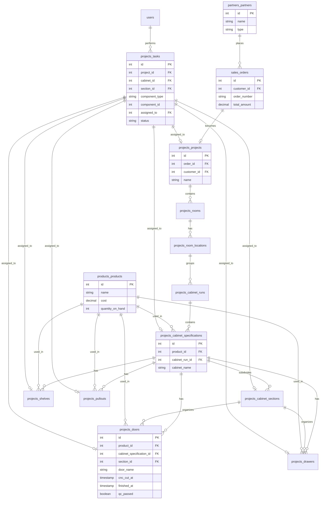
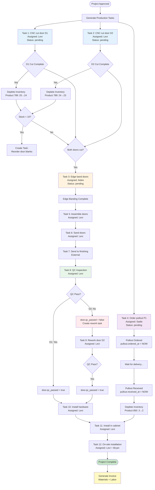
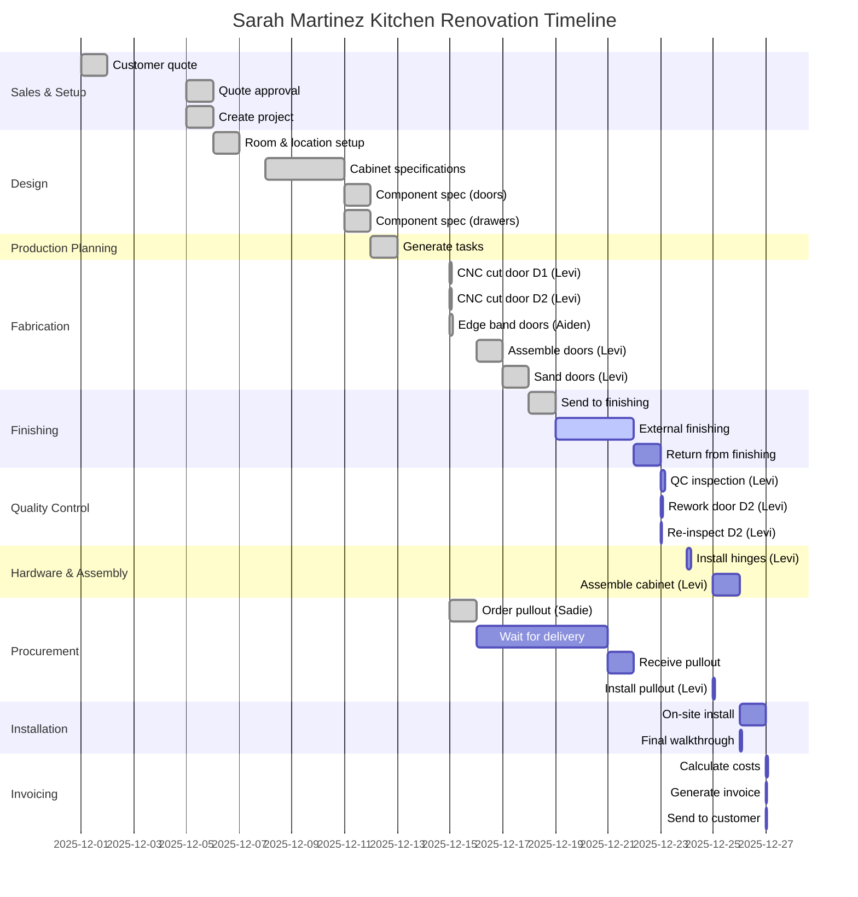
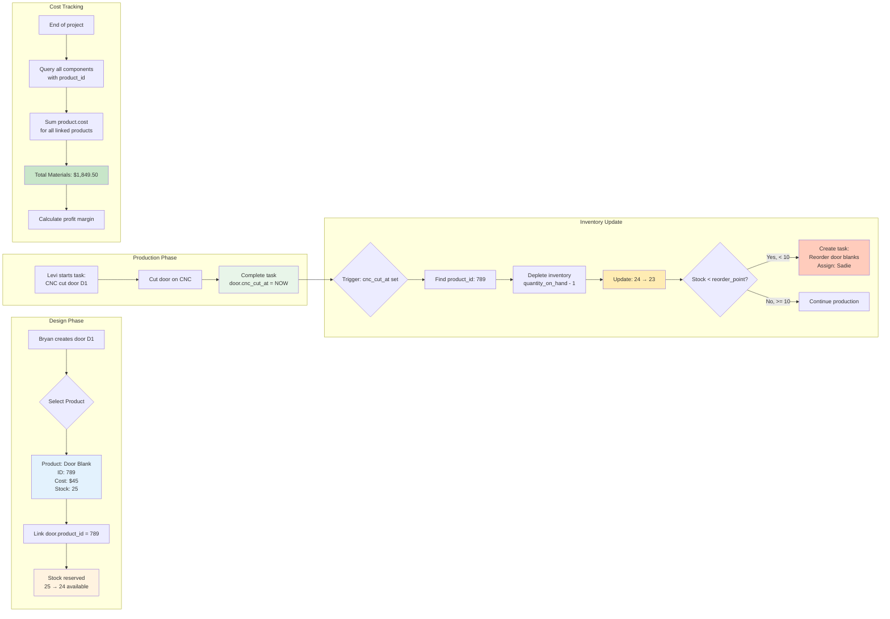
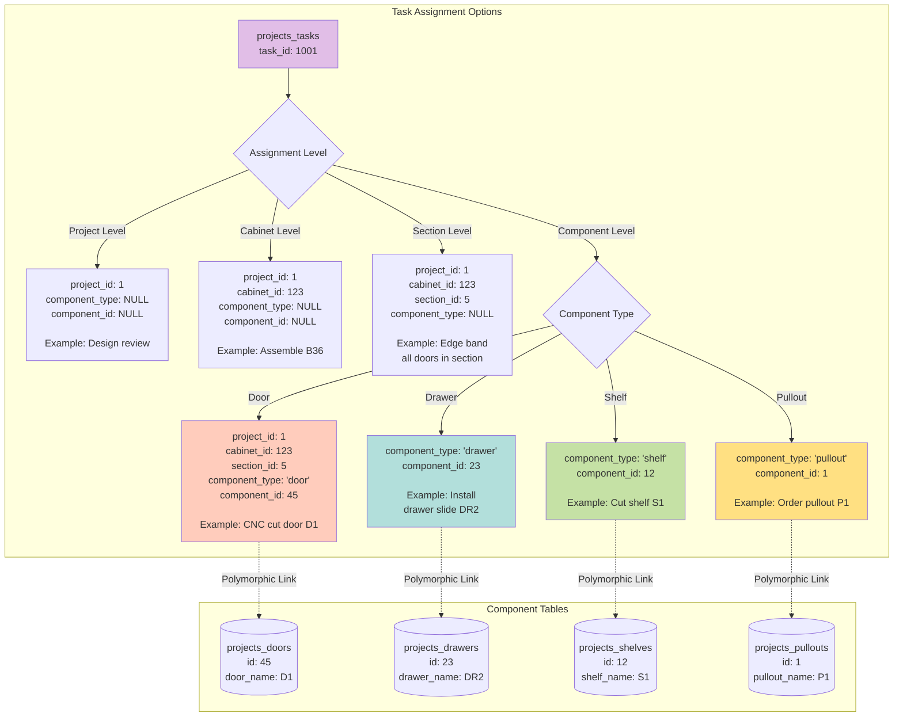
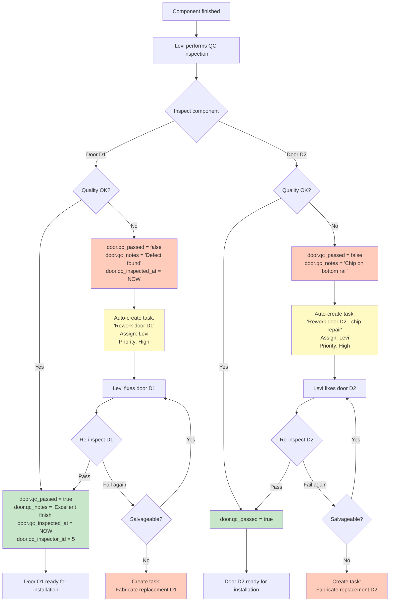

# Use Case Mermaid Diagrams

**Date:** 2025-11-21
**Project:** Sarah Martinez Kitchen Renovation
**Purpose:** Visual workflow diagrams

---

## Diagram 1: Complete Workflow Sequence

```mermaid
sequenceDiagram
    participant Customer as Sarah Martinez<br/>(Customer)
    participant Bryan as Bryan<br/>(Owner)
    participant System as AureusERP<br/>Database
    participant Levi as Levi<br/>(Lead Craftsman)
    participant Aiden as Aiden<br/>(Warehouse)
    participant Sadie as Sadie<br/>(Purchasing)
    participant Inventory as Products<br/>Inventory

    rect rgb(240, 248, 255)
        Note over Customer,Bryan: PHASE 1: SALES & PROJECT SETUP
        Customer->>Bryan: Request kitchen renovation quote
        Bryan->>System: Create customer record<br/>(partners_partners)
        Bryan->>System: Create sales order Q-2025-001<br/>($85,000)
        Bryan->>Customer: Send quote
        Customer->>Bryan: Approve quote
        Bryan->>System: Convert to project<br/>(projects_projects)
    end

    rect rgb(255, 248, 240)
        Note over Bryan,System: PHASE 2: DESIGN & SPECIFICATION
        Bryan->>System: Create room: Kitchen<br/>(projects_rooms)
        Bryan->>System: Create location: Island<br/>(projects_room_locations)
        Bryan->>System: Create cabinet run<br/>(projects_cabinet_runs)
        Bryan->>System: Create cabinet B36<br/>Link to product_id: 456
        Bryan->>System: Create section: Door Opening<br/>(projects_cabinet_sections)
        Bryan->>System: Create door D1<br/>Link to product_id: 789
        Bryan->>System: Create door D2<br/>Link to product_id: 789
        System->>Inventory: Reserve 2 door blanks<br/>(25 → 23 available)
        Bryan->>System: Create pullout P1<br/>Link to product_id: 850
        System->>Inventory: Reserve Rev-A-Shelf unit<br/>(3 → 2 available)
    end

    rect rgb(240, 255, 240)
        Note over Bryan,System: PHASE 3: TASK GENERATION
        Bryan->>System: Generate production tasks
        System->>System: Create task: CNC cut D1<br/>Assign to Levi
        System->>System: Create task: CNC cut D2<br/>Assign to Levi
        System->>System: Create task: Edge band<br/>Assign to Aiden<br/>Depends on: [D1, D2]
        System->>System: Create task: Order pullout<br/>Assign to Sadie
    end

    rect rgb(255, 240, 255)
        Note over Levi,Inventory: PHASE 4: PRODUCTION - DAY 15
        Levi->>System: Start task: CNC cut D1
        Levi->>Levi: Cut door D1 on CNC
        Levi->>System: Complete task<br/>Set door.cnc_cut_at = NOW()
        System->>Inventory: Deplete inventory<br/>product_id: 789<br/>(23 → 22 blanks)

        Levi->>System: Start task: CNC cut D2
        Levi->>Levi: Cut door D2 on CNC
        Levi->>System: Complete task<br/>Set door.cnc_cut_at = NOW()
        System->>Inventory: Deplete inventory<br/>(22 → 21 blanks)

        Note over System,Inventory: Inventory check: 21 blanks remaining
        System->>System: Stock OK (threshold: 10)

        Aiden->>System: Start task: Edge band doors<br/>(Dependencies complete)
        Aiden->>Aiden: Apply edge banding
        Aiden->>System: Complete task<br/>Set edge_banded_at = NOW()

        Sadie->>System: Start task: Order pullout
        Sadie->>Inventory: Create PO to Rev-A-Shelf
        Sadie->>System: Complete task<br/>Set pullout.ordered_at = NOW()
    end

    rect rgb(255, 255, 240)
        Note over Levi,System: PHASE 5: ASSEMBLY - DAY 16-22
        Levi->>System: Set door.assembled_at = NOW()
        Levi->>System: Set door.sanded_at = NOW()
        Note over Levi,System: Send to finishing (external)
        System->>System: Set door.finished_at = NOW()<br/>(Day 22 - returned)
    end

    rect rgb(240, 255, 255)
        Note over Levi,System: PHASE 6: QC INSPECTION - DAY 23
        Levi->>Levi: Inspect door D1
        Levi->>System: door D1: qc_passed = true<br/>"Excellent finish"
        Levi->>Levi: Inspect door D2
        Levi->>System: door D2: qc_passed = false<br/>"Chip on bottom rail"
        System->>System: Auto-create task:<br/>"Rework door D2"
        Levi->>Levi: Touch up door D2
        Levi->>System: door D2: qc_passed = true
    end

    rect rgb(255, 240, 240)
        Note over Levi,System: PHASE 7: INSTALLATION - DAY 26
        Levi->>System: Set hardware_installed_at = NOW()
        Levi->>System: Set installed_in_cabinet_at = NOW()
        Levi->>Customer: Install at 1428 Oak Street
        Levi->>System: Complete installation task
        System->>System: Set project.status = completed
    end

    rect rgb(248, 248, 255)
        Note over Bryan,Customer: PHASE 8: INVOICING - DAY 27
        Bryan->>System: Calculate costs:<br/>Materials: $1,849.50<br/>Labor: $1,875
        Bryan->>System: Create invoice INV-2025-001<br/>$93,075 (incl tax)
        Bryan->>Customer: Send invoice
        Customer->>Bryan: Payment received
        Note over Bryan,Customer: Profit: $81,275.50 (95.6%)
    end
```



---

## Diagram 2: Database Relationships



---

## Diagram 3: Task Dependencies Flow



---

## Diagram 4: Production Timeline (Gantt Chart)



---

## Diagram 5: Inventory Integration Flow



---

## Diagram 6: Task-Component Polymorphic Relationship



---

## Diagram 7: QC Workflow Decision Tree



---

## Diagram 8: Complete 7-Level Cabinet Hierarchy

```mermaid
graph TB
    subgraph Level 1: Project
        Project[Sarah Martinez<br/>Kitchen Renovation<br/><br/>projects_projects<br/>id: 1<br/>name: 'Sarah Martinez Kitchen'<br/>project_number: 'PRJ-2025-001'<br/>total_value: $85,000]
    end

    subgraph Level 2: Rooms
        Project --> Room1[Kitchen<br/><br/>projects_rooms<br/>id: 5<br/>name: 'Kitchen'<br/>room_type: 'kitchen']
        Project --> Room2[Pantry<br/><br/>projects_rooms<br/>id: 6<br/>name: 'Butler Pantry']
    end

    subgraph Level 3: Room Locations
        Room1 --> Loc1[Island<br/><br/>projects_room_locations<br/>id: 8<br/>name: 'Center Island'<br/>position: 'Center']
        Room1 --> Loc2[North Wall<br/><br/>projects_room_locations<br/>id: 9<br/>name: 'North Wall Uppers']
        Room1 --> Loc3[South Wall<br/><br/>projects_room_locations<br/>id: 10<br/>name: 'South Wall Base']
    end

    subgraph Level 4: Cabinet Runs
        Loc1 --> Run1[Island Base Cabinets<br/><br/>projects_cabinet_runs<br/>id: 3<br/>run_name: 'Island Base Run'<br/>total_linear_feet: 8.0<br/>sequence_order: 1]
        Loc2 --> Run2[Upper Wall Cabinets<br/><br/>projects_cabinet_runs<br/>id: 4<br/>total_linear_feet: 12.5]
    end

    subgraph Level 5: Cabinets
        Run1 --> Cab1[B36 Sink Base<br/><br/>projects_cabinet_specifications<br/>id: 123<br/>product_id: 456<br/>cabinet_name: 'B36'<br/>width_inches: 36<br/>height_inches: 34.5<br/>depth_inches: 24]
        Run1 --> Cab2[B24 Base<br/><br/>projects_cabinet_specifications<br/>id: 124<br/>product_id: 457<br/>cabinet_name: 'B24']
        Run1 --> Cab3[B18 Base<br/><br/>projects_cabinet_specifications<br/>id: 125<br/>cabinet_name: 'B18']
    end

    subgraph Level 6: Sections
        Cab1 --> Sec1[Door Opening Section<br/><br/>projects_cabinet_sections<br/>id: 5<br/>section_number: 1<br/>section_type: 'door_opening'<br/>width_inches: 36<br/>height_inches: 28<br/>component_count: 2]
        Cab1 --> Sec2[Pullout Section<br/><br/>projects_cabinet_sections<br/>id: 6<br/>section_number: 2<br/>section_type: 'pullout_area'<br/>component_count: 1]
    end

    subgraph Level 7: Components - 4 Types
        Sec1 --> Door1[Door D1<br/><br/>projects_doors<br/>id: 45<br/>product_id: 789<br/>door_number: 1<br/>door_name: 'D1'<br/>width: 17.5"<br/>height: 28"<br/>hinge_type: 'full_overlay'<br/><br/>Production:<br/>cnc_cut_at: 2025-12-15<br/>finished_at: 2025-12-22<br/>qc_passed: true]

        Sec1 --> Door2[Door D2<br/><br/>projects_doors<br/>id: 46<br/>product_id: 789<br/>door_number: 2<br/>door_name: 'D2'<br/>width: 17.5"<br/>height: 28"<br/><br/>Production:<br/>cnc_cut_at: 2025-12-15<br/>qc_passed: false<br/>qc_notes: 'Chip on rail']

        Sec2 --> Pullout1[Pullout P1<br/><br/>projects_pullouts<br/>id: 1<br/>product_id: 850<br/>pullout_number: 1<br/>pullout_name: 'P1'<br/>pullout_type: 'trash'<br/>manufacturer: 'Rev-A-Shelf'<br/>model: '5149-18DM-217'<br/><br/>Procurement:<br/>ordered_at: 2025-12-15<br/>received_at: 2025-12-21]

        Cab2 --> Sec3[Drawer Stack Section<br/><br/>projects_cabinet_sections<br/>id: 7<br/>section_type: 'drawer_stack'<br/>component_count: 3]

        Sec3 --> Drawer1[Drawer DR1<br/><br/>projects_drawers<br/>id: 23<br/>product_id: 801<br/>drawer_number: 1<br/>drawer_name: 'DR1 - Top'<br/>drawer_position: 'top'<br/>front_width: 22"<br/>front_height: 6"<br/><br/>Box Details:<br/>box_material: 'maple'<br/>slide_type: 'blum_undermount']

        Sec3 --> Drawer2[Drawer DR2<br/><br/>projects_drawers<br/>id: 24<br/>drawer_name: 'DR2 - Middle']

        Sec3 --> Drawer3[Drawer DR3<br/><br/>projects_drawers<br/>id: 25<br/>drawer_name: 'DR3 - Bottom']

        Cab3 --> Sec4[Open Shelving Section<br/><br/>projects_cabinet_sections<br/>id: 8<br/>section_type: 'open_shelving'<br/>component_count: 2]

        Sec4 --> Shelf1[Shelf S1<br/><br/>projects_shelves<br/>id: 12<br/>product_id: 820<br/>shelf_number: 1<br/>shelf_name: 'S1'<br/>shelf_type: 'adjustable'<br/>width: 17"<br/>depth: 23"<br/>material: 'plywood'<br/>edge_treatment: 'edge_banded']

        Sec4 --> Shelf2[Shelf S2<br/><br/>projects_shelves<br/>id: 13<br/>shelf_name: 'S2']
    end

    %% Color coding by level
    style Project fill:#e1f5ff,stroke:#01579b,stroke-width:3px
    style Room1 fill:#f3e5f5,stroke:#4a148c,stroke-width:2px
    style Room2 fill:#f3e5f5,stroke:#4a148c,stroke-width:2px
    style Loc1 fill:#e8f5e9,stroke:#1b5e20,stroke-width:2px
    style Loc2 fill:#e8f5e9,stroke:#1b5e20,stroke-width:2px
    style Loc3 fill:#e8f5e9,stroke:#1b5e20,stroke-width:2px
    style Run1 fill:#fff3e0,stroke:#e65100,stroke-width:2px
    style Run2 fill:#fff3e0,stroke:#e65100,stroke-width:2px
    style Cab1 fill:#fce4ec,stroke:#880e4f,stroke-width:2px
    style Cab2 fill:#fce4ec,stroke:#880e4f,stroke-width:2px
    style Cab3 fill:#fce4ec,stroke:#880e4f,stroke-width:2px
    style Sec1 fill:#e0f2f1,stroke:#004d40,stroke-width:2px
    style Sec2 fill:#e0f2f1,stroke:#004d40,stroke-width:2px
    style Sec3 fill:#e0f2f1,stroke:#004d40,stroke-width:2px
    style Sec4 fill:#e0f2f1,stroke:#004d40,stroke-width:2px

    %% Color coding by component type
    style Door1 fill:#ffccbc,stroke:#bf360c,stroke-width:2px
    style Door2 fill:#ffccbc,stroke:#bf360c,stroke-width:2px
    style Drawer1 fill:#b2dfdb,stroke:#00695c,stroke-width:2px
    style Drawer2 fill:#b2dfdb,stroke:#00695c,stroke-width:2px
    style Drawer3 fill:#b2dfdb,stroke:#00695c,stroke-width:2px
    style Shelf1 fill:#c5e1a5,stroke:#33691e,stroke-width:2px
    style Shelf2 fill:#c5e1a5,stroke:#33691e,stroke-width:2px
    style Pullout1 fill:#ffe082,stroke:#f57f17,stroke-width:2px
```

### Hierarchy Summary

**Level 1: Project** (Blue)
- `projects_projects` - Top level container
- Example: Sarah Martinez Kitchen Renovation ($85,000 project)

**Level 2: Room** (Purple)
- `projects_rooms` - Physical rooms in the project
- Example: Kitchen, Butler Pantry

**Level 3: Room Location** (Green)
- `projects_room_locations` - Specific areas within rooms
- Example: Center Island, North Wall, South Wall

**Level 4: Cabinet Run** (Orange)
- `projects_cabinet_runs` - Groups of adjacent cabinets
- Example: Island Base Run (8.0 linear feet)

**Level 5: Cabinet** (Pink)
- `projects_cabinet_specifications` - Individual cabinet specifications
- Example: B36 Sink Base (36" wide, 34.5" high, 24" deep)
- Links to `products_products` via `product_id`

**Level 6: Section** (Teal)
- `projects_cabinet_sections` - Subdivisions within cabinets
- Types: door_opening, drawer_stack, open_shelving, pullout_area
- Example: Door Opening Section (2 doors)

**Level 7: Component** (4 Types)
- **Doors** (Coral) - `projects_doors`
  - Example: D1 - Full overlay door, CNC cut, QC passed

- **Drawers** (Mint) - `projects_drawers`
  - Example: DR1 - Top drawer with Blum undermount slides

- **Shelves** (Light Green) - `projects_shelves`
  - Example: S1 - Adjustable shelf with edge banding

- **Pullouts** (Yellow) - `projects_pullouts`
  - Example: P1 - Rev-A-Shelf trash pullout

### Key Relationships

```sql
-- Navigate from Project to Component
SELECT doors.*
FROM projects_projects
JOIN projects_rooms ON projects_rooms.project_id = projects_projects.id
JOIN projects_room_locations ON projects_room_locations.room_id = projects_rooms.id
JOIN projects_cabinet_runs ON projects_cabinet_runs.room_location_id = projects_room_locations.id
JOIN projects_cabinet_specifications ON projects_cabinet_specifications.cabinet_run_id = projects_cabinet_runs.id
JOIN projects_cabinet_sections ON projects_cabinet_sections.cabinet_specification_id = projects_cabinet_specifications.id
JOIN projects_doors AS doors ON doors.section_id = projects_cabinet_sections.id
WHERE projects_projects.id = 1;
```

### Task Assignment at Any Level

```sql
-- Project-level task
INSERT INTO projects_tasks (project_id, title)
VALUES (1, 'Design review for entire project');

-- Cabinet-level task
INSERT INTO projects_tasks (project_id, cabinet_specification_id, title)
VALUES (1, 123, 'Assemble cabinet B36');

-- Section-level task
INSERT INTO projects_tasks (project_id, section_id, title)
VALUES (1, 5, 'Install door opening hardware');

-- Component-level task (door)
INSERT INTO projects_tasks (project_id, component_type, component_id, title)
VALUES (1, 'door', 45, 'CNC cut door D1');

-- Component-level task (drawer)
INSERT INTO projects_tasks (project_id, component_type, component_id, title)
VALUES (1, 'drawer', 23, 'Install drawer slide DR1');
```

---

## How to View These Diagrams

### Option 1: GitHub/GitLab
- Push this file to your repo
- GitHub/GitLab will render Mermaid automatically

### Option 2: VS Code
- Install "Markdown Preview Mermaid Support" extension
- Open this file and press `Ctrl+Shift+V` (preview)

### Option 3: Mermaid Live Editor
- Copy any diagram code
- Paste into https://mermaid.live
- Export as PNG/SVG

### Option 4: FilamentPHP Documentation
- Use these diagrams in your internal docs
- Export as images for training materials

---

## Next Step: Run Migrations

**Ready to make this real?** 🚀

```bash
DB_CONNECTION=mysql php artisan migrate
```

This will create all the tables shown in these diagrams!

---

**Document Created:** 2025-11-21
**Diagrams:** 7 Mermaid visualizations of complete workflow
**Purpose:** Visual representation of use case from quote to completion
